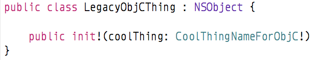

# [SO 33775908](http://stackoverflow.com/questions/33775908)

## Steps
1. Open `SO33775908.xcodeproj`
1. Run and checkout normal situation
1. Modify the `SadStory.swift` and check the error

If you `Open quickly…` the `LegacyObjCThing.h` you will see the automatically swift header of `LegacyObjCThing` class:

which is wrong.

Environment: Xcode 7.1.1

## Workarounds
1. [No special ObjC name](https://github.com/puttin/SO33775908/tree/Workaround1)
